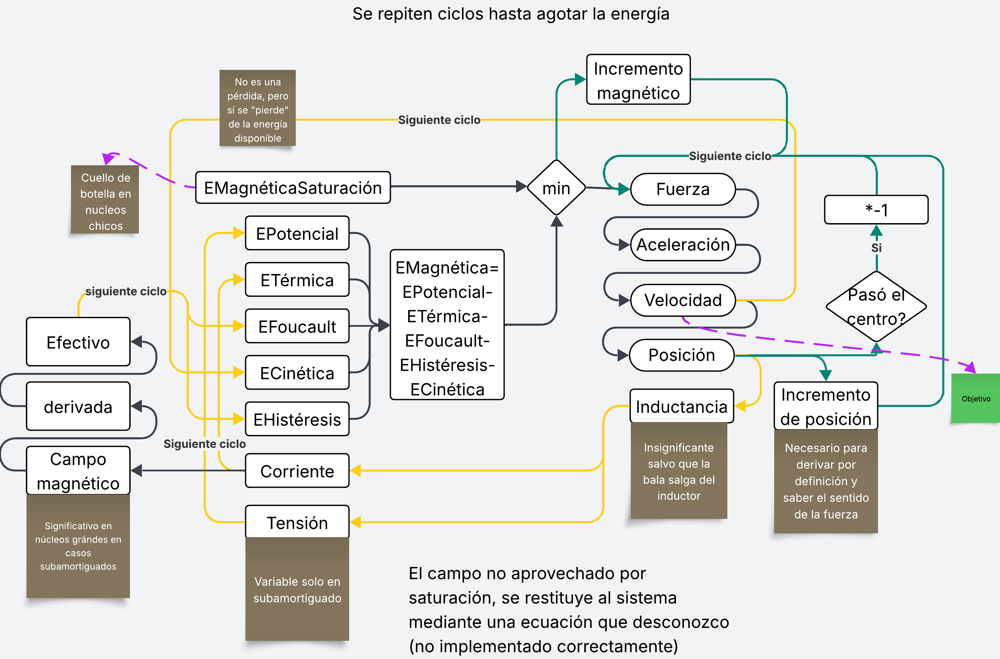
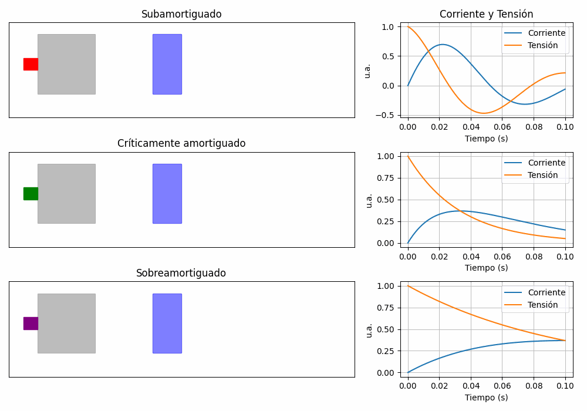

# Simulación y Modelo Matemático del Gauss Cannon (`math.py`)

Este documento explica rigurosamente la estructura, funcionamiento y lógica del archivo `math.py`, que implementa la simulación física y energética de un cañón Gauss. Aquí encontrarás:
- Objetivo y alcance del archivo
- Diagrama de flujo visual del ciclo de simulación
- Animación ilustrativa de los regímenes de amortiguación
- Documentación matemática de cada bloque
- Explicación de la importancia y limitaciones de cada sección
- Guía para modificar y extender el código correctamente

---

## Objetivo y Alcance

El archivo `math.py` simula el comportamiento físico de un cañón Gauss, modelando la transferencia de energía entre el capacitor, el campo magnético, las pérdidas (Joule, Foucault, histéresis) y la energía cinética del proyectil. El modelo es **discreto**: cada ciclo de simulación actualiza las variables físicas paso a paso, permitiendo observar la evolución temporal y el balance energético.

El objetivo es obtener un modelo físicamente realista, numéricamente estable y fácilmente modificable para explorar variantes constructivas y físicas.

---

## Diagrama de Flujo del Ciclo de Simulación

---

## Animación Ilustrativa de los Tres Regímenes de Amortiguación

> **Comparación visual:**
>
> 
>
> - **Subamortiguado:** Movimiento oscilante y rápido, corriente/tensión con sobreoscilaciones.
> - **Críticamente amortiguado:** Movimiento rápido y sin oscilaciones, corriente/tensión decaen suavemente.
> - **Sobreamortiguado:** Movimiento lento, corriente/tensión decaen muy despacio.

---

## Documentación Matemática y Física

La lógica y las ecuaciones implementadas están detalladas en [`ecuaciones_simulacion.md`](ecuaciones_simulacion.md). Allí se explican:
- Definición de constantes y parámetros de entrada
- Cálculo geométrico de la bobina y el núcleo
- Ecuaciones diferenciales del circuito RLC
- Cálculo de energía magnética, pérdidas y cinética
- Actualización de variables en el ciclo discreto
- Balance energético y eficiencia

---

## Equilibrio Energético: Interpretación Física y Diseño

- **Disipación térmica (Joule):** Es inevitable y se reduce optimizando la resistencia del sistema (cobre grueso, bobina corta). No es mala en sí, pero debe minimizarse para mejorar la eficiencia.
- **Pérdida por Foucault:** Solo es significativa en núcleos grandes. En núcleos pequeños o delgados, su impacto es menor. Si el núcleo es voluminoso, esta pérdida puede limitar la eficiencia.
- **Pérdida por histéresis:** Es baja en magnitud (proporcional al área del lazo ABH), pero su importancia radica en la saturación: si el núcleo entra y sale de saturación repetidamente (caso subamortiguado grave), la pérdida puede aumentar y el núcleo deja de aprovechar el campo magnético.
- **Saturación magnética:** Es el principal limitante en núcleos pequeños o con mucho campo. Si el núcleo se satura antes de llegar al centro, la fuerza útil cae y la eficiencia baja.
- **Régimen subamortiguado:** No es necesariamente malo, pero es complejo de analizar y puede llevar a inversiones de corriente que aumentan pérdidas por histéresis y dificultan el control.
- **Régimen críticamente amortiguado:** Es el ideal para máxima velocidad, pero es muy sensible a los parámetros: cualquier desviación lo convierte en sub o sobreamortiguado. En la práctica, se busca un tau corto (amortiguamiento bajo) pero sin llegar a saturar el núcleo antes de que reciba el impulso.
- **Régimen sobreamortiguado:** Es robusto y fácil de controlar, pero limita la velocidad máxima porque la fuerza se reparte en un tiempo largo y el núcleo puede no aprovechar todo el campo antes de salir del inductor.
- **Lo realmente malo:** Un núcleo pequeño que se satura rápido, o un tau tan largo que la energía se disipa antes de que el núcleo cruce el centro. También, si la suma de energías no cierra (cinética + pérdidas + magnética ≈ inicial), hay un error de implementación o concepto.

**Resumen de diseño:**
- La energía cinética máxima se logra con un núcleo grande, un tau corto (pero no tan corto que sature antes de tiempo) y pérdidas minimizadas.
- El equilibrio energético es la principal herramienta de validación: toda la energía inicial debe estar explicada al final del ciclo.
- El modelo no incluye fricción, por lo que la energía cinética depende solo de la fuerza útil remanente tras saturación y pérdidas.

**¿Cuándo es relevante?**
- Siempre que modifiques el modelo físico, la sección de pérdidas, o la forma de calcular la fuerza, revisa el balance energético.
- Si la suma de energías no cierra, hay un error de implementación o de concepto.

---

## Estructura y Relevancia de Cada Parte

- **Constantes y parámetros:**
  - Relevantes para definir el escenario físico y constructivo. Modificar aquí cambia el modelo físico.
- **Cálculo geométrico:**
  - Determina la resistencia, inductancia y masa. Fundamental para la física del sistema.
- **Ecuaciones diferenciales:**
  - Determinan el régimen de amortiguación. Cambiar aquí afecta la dinámica eléctrica.
- **Ciclo de simulación discreto:**
  - Núcleo del modelo. Aquí se actualizan todas las variables físicas paso a paso.
- **Cálculo de pérdidas:**
  - Esencial para el balance energético y la eficiencia. No modificar sin justificación física.
- **Balance y prints:**
  - Útiles para diagnóstico y validación. Se pueden ampliar para más métricas.

---

## Limitaciones y Consideraciones

- El modelo es **1D** y asume simetría axial.
- No incluye efectos de fricción, aire ni no-linealidades complejas.
- La saturación magnética se modela como un límite duro.
- El cálculo de fuerza es una aproximación basada en diferenciales de energía.
- El cálculo es **discreto**: la precisión depende de `dt`.
- El flujo magnético se usa solo para pérdidas, no para la fuerza.

---

## ¿Cómo modificar el archivo correctamente?

- Cambia parámetros físicos y geométricos solo en la sección de constantes.
- Si agregas nuevas pérdidas, inclúyelas en el balance energético y en el cálculo de energía magnética disponible.
- Si modificas la física (fuerza, saturación, etc.), revisa el diagrama de flujo y la documentación matemática.
- Mantén la lógica de actualización discreta: cada ciclo debe conservar el balance energético.
- Usa siempre `np.float32` para variables numéricas relevantes.
- Si agregas nuevas salidas, hazlo en la sección de prints finales.

---

## Consejos prácticos de diseño y ajuste

- **Pocas vueltas:** poco campo magnético, baja aceleración.
- **Muchas vueltas:** más campo, pero también mucha resistencia, lo que reduce la eficiencia. Hay que buscar un equilibrio.
- **Mucho núcleo:** más masa, pero menor velocidad final (cuesta acelerarlo).
- **Poco núcleo:** se satura rápido y tampoco logra buena velocidad.
- **Bobina muy larga:** dispersa el campo y pierde eficiencia.
- **Bobina muy corta:** no da tiempo suficiente para acelerar el núcleo.
- **Muchas capas:** el campo decae hacia afuera, pero permiten más vueltas en menos largo. Es una consecuencia inevitable del diseño compacto.
- **Alambre grueso:** baja la resistencia, pero separa las vueltas y dispersa el campo. El calibre ideal suele estar entre 0,1 mm y 1 mm.

**Rangos típicos recomendados:**
- Largo de bobina: 3 cm a 20 cm
- Vueltas: 40 a 300
- Calibre de alambre: 0,1 mm a 1 mm
- Núcleo: ni muy pequeño (alfiler) ni muy grande (moneda); el diámetro mínimo del inductor suele estar cerca de 5 mm para masas de núcleo típicas.

Estos parámetros permiten un diseño equilibrado y funcional para la mayoría de los experimentos y simulaciones de cañón Gauss de esta escala. Para buscar lo idóneo debe perfeccionarse este cálculo matemático y usar el optimizador paramétrico de la documentación, el cuál tiene esta matemática incompleta. Esto deriva a usar bobinas aproximadas o terminar de ajustar este simulador, para aplicarlo al paramétrico y optimizarlo con cython.

---

## Referencias cruzadas
- [ecuaciones_simulacion.md](ecuaciones_simulacion.md): detalle matemático y físico
- [simulacion_ilustrativa.py](simulacion_ilustrativa.py): script para animaciones y visualización conceptual

---

> Este README es la referencia principal para entender, modificar y validar el archivo `math.py` en el contexto del proyecto Gauss Cannon.
